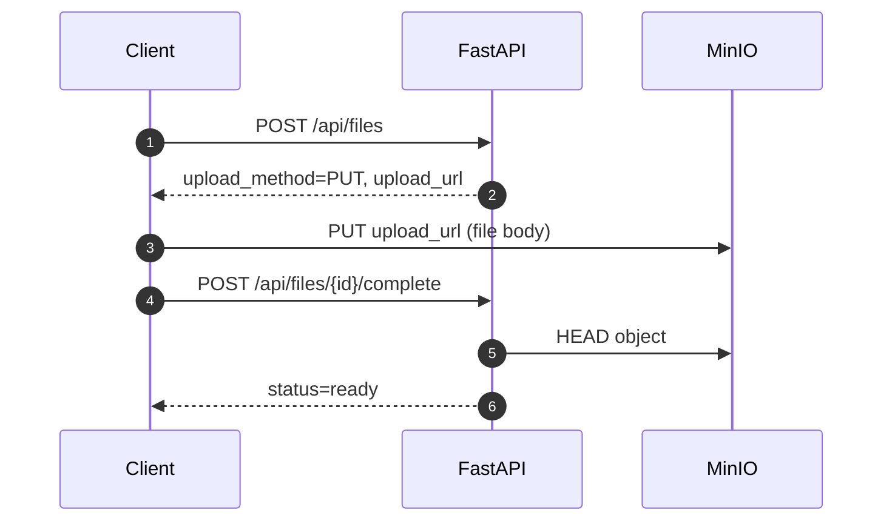
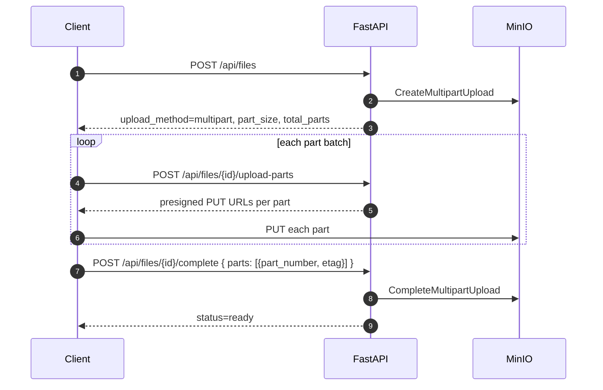

# File Share Service

A self-hosted file sharing & storage service. Backend in **FastAPI** with S3-compatible storage (**MinIO** locally), frontend in **React + Vite + TypeScript**, packaged as **Docker Compose**. Authentication uses **JWT**, files upload directly to object storage via **presigned PUT URLs** (the API never proxies bytes), and shareable links support optional password protection and expiry.

## Stack

- **Frontend**: React 18 + Vite + TypeScript, Tailwind CSS + shadcn-style primitives (Radix), TanStack Query, Zustand, react-hook-form + zod, sonner toasts
- **API**: FastAPI + Pydantic v2
- **DB**: PostgreSQL 16 (async via SQLAlchemy 2 + asyncpg, migrations via Alembic)
- **Storage**: MinIO (S3 API, swappable for AWS S3 / Cloudflare R2)
- **Auth**: JWT (HS256) with Argon2 password hashing
- **Containers**: Docker Compose (`web`, `api`, `postgres`, `minio`, `minio-init`)

## Configuration (key env vars)

| Variable | Default | Notes |
|---|---|---|
| `JWT_SECRET` | `change-me-...` | **Set this** in production |
| `JWT_ACCESS_TTL_MINUTES` | `60` | Access token lifetime |
| `SINGLE_PUT_MAX_BYTES` | `5368709120` | **5 GB** — max size for a single presigned PUT |
| `MAX_FILE_BYTES` | `5497558138880` | **5 TiB** — max stored object (multipart above 5 GB) |
| `MULTIPART_PART_SIZE_BYTES` | `67108864` | **64 MiB** — size of each multipart part |
| `S3_ENDPOINT_URL` | `http://minio:9000` | Used by API container internally |
| `S3_PUBLIC_ENDPOINT_URL` | `http://localhost:9000` | Used to sign URLs that **clients** can reach |
| `S3_BUCKET` | `files` | Bucket auto-created on startup |
| `PRESIGN_PUT_TTL_SECONDS` | `3600` | Upload URL lifetime |
| `PRESIGN_GET_TTL_SECONDS` | `900` | Download URL lifetime |

Copy `.env.example` to `.env` and override.

## Quick start

```bash
cp .env.example .env
docker compose up --build
```

Services:
- Web UI: <http://localhost:5173>
- API: <http://localhost:8000> (docs at `/docs`)
- MinIO console: <http://localhost:19001> (default `minioadmin` / `minioadmin`; host port `19001` avoids Windows reserved ranges around 9000–9001)
- Postgres: `localhost:5432`

Database migrations run automatically on API start (see `scripts/entrypoint.sh`).

## Upload flow

Files **≤ 5 GB** use a single presigned PUT. Files **> 5 GB** use S3 multipart upload (parts uploaded directly to storage; the API only signs URLs and finalizes).

### Single PUT (≤ 5 GB)



### Multipart (> 5 GB)



Why presigned: file bytes never go through the API process; the FastAPI container only handles small JSON requests.

## Endpoints

Auth (public):
- `POST /api/auth/register` — `{ "email", "password" }`
- `POST /api/auth/login` — form fields `username` (= email) + `password`, returns JWT
- `GET /api/auth/me` — current user (requires `Authorization: Bearer ...`)

Files (JWT required):
- `POST /api/files` — start upload (single PUT or multipart, based on size)
- `POST /api/files/{file_id}/upload-parts` — presigned URLs for multipart part numbers
- `POST /api/files/{file_id}/complete` — finalize upload (`parts` required for multipart)
- `GET /api/files` — list current user's files
- `GET /api/files/{file_id}` — metadata
- `GET /api/files/{file_id}/download` — presigned GET URL
- `DELETE /api/files/{file_id}` — delete metadata + object

Shares (JWT required):
- `POST /api/files/{file_id}/shares` — create share link with optional `expires_in_seconds` and `password`
- `GET /api/files/{file_id}/shares` — list shares for a file
- `DELETE /api/files/{file_id}/shares/{token}` — revoke

Public (no auth):
- `GET /api/public/{token}` — share metadata (filename, size, password_protected, expires_at)
- `POST /api/public/{token}/download` — body `{ "password": "..." }` if protected; returns presigned URL

Health:
- `GET /health`

## Example

```bash
# 1. register & login
curl -s -X POST http://localhost:8000/api/auth/register \
  -H 'Content-Type: application/json' \
  -d '{"email":"me@example.com","password":"supersecret1"}'

TOKEN=$(curl -s -X POST http://localhost:8000/api/auth/login \
  -d 'username=me@example.com&password=supersecret1' | jq -r .access_token)

# 2. request upload URL
RESP=$(curl -s -X POST http://localhost:8000/api/files \
  -H "Authorization: Bearer $TOKEN" \
  -H 'Content-Type: application/json' \
  -d '{"filename":"hello.txt","content_type":"text/plain","size_bytes":12}')

FID=$(echo $RESP | jq -r .file_id)
URL=$(echo $RESP | jq -r .upload_url)

# 3. upload directly to MinIO
echo -n 'hello world!' | curl -X PUT "$URL" -H 'Content-Type: text/plain' --data-binary @-

# 4. mark as ready
curl -s -X POST "http://localhost:8000/api/files/$FID/complete" \
  -H "Authorization: Bearer $TOKEN"

# 5. share + download as guest
SHARE=$(curl -s -X POST "http://localhost:8000/api/files/$FID/shares" \
  -H "Authorization: Bearer $TOKEN" \
  -H 'Content-Type: application/json' \
  -d '{"expires_in_seconds":3600}')

TOK=$(echo $SHARE | jq -r .token)
DL=$(curl -s -X POST "http://localhost:8000/api/public/$TOK/download" \
  -H 'Content-Type: application/json' -d '{}' | jq -r .download_url)

curl -L "$DL"
```

## Tests

Tests run as integration tests against the live stack:

```bash
docker compose up -d
docker compose exec api pip install pytest pytest-asyncio
docker compose exec api pytest -q
```

## Security notes (MVP scope)

- All file types are accepted by design. The service does **not** scan for malware/executables — treat uploads as untrusted; for production add ClamAV or similar.
- JWT secret must be rotated for production; access tokens are short-lived (60 min default).
- Presigned URLs are time-limited; revoke shares via DELETE.
- Postgres and MinIO ports are exposed in compose for local development; restrict in production.

## Project layout

```
app/                 # FastAPI backend
  main.py            # FastAPI factory + lifespan
  config.py          # Settings (pydantic-settings)
  db.py              # async SQLAlchemy engine/session
  models.py          # User, StoredFile, ShareLink
  schemas.py         # Pydantic schemas
  security.py        # Argon2 + JWT
  deps.py            # get_current_user
  storage.py         # S3/MinIO client + presigned URLs
  routers/           # auth, files, shares, public
alembic/             # migrations
scripts/entrypoint.sh
web/                 # React + Vite frontend
  src/
    main.tsx, App.tsx
    lib/             # axios, auth-store, api/* clients
    components/      # ui/, layout/, files/
    pages/           # Login, Register, Dashboard, FileDetail, PublicShare
    hooks/           # useFiles, useUpload, useTheme
  Dockerfile         # multi-stage build -> nginx:alpine
  nginx.conf         # SPA fallback + asset caching
docker-compose.yml
Dockerfile
```

## Frontend

The UI is a single-page React app served by **nginx** in production builds. It uses JWT (stored in `localStorage`) to talk to the API, drags files straight to MinIO via presigned PUTs, and renders a Linear/Notion-inspired layout with dark mode.

### Dev workflow

```bash
cd web
cp .env.example .env       # VITE_API_URL=http://localhost:8000
npm install
npm run dev                # http://localhost:5173 with HMR
```

The dev server expects the API at `VITE_API_URL`. The simplest setup: keep the API running via `docker compose up -d api postgres minio`, and run `npm run dev` on the host.

### Build & serve (Docker)

```bash
docker compose up -d --build web
# http://localhost:5173  (nginx serving the built SPA)
```

nginx proxies `/api/` to the `api` container, so the bundle uses **relative URLs** by default - the frontend automatically targets whatever host the SPA was served from (localhost, LAN IP, custom domain) without rebuilding.

If you want the SPA to talk to an API on a different origin, bake the absolute URL in:

```bash
VITE_API_URL=https://api.example.com docker compose build web
```

### Accessing from another device on the LAN (e.g. your phone)

The frontend works on any reachable host (HMR proxy handles `/api/` correctly), **but presigned URLs for upload/download point to MinIO directly**. Set `S3_PUBLIC_ENDPOINT_URL` to a URL that other devices can reach:

```env
# .env
S3_PUBLIC_ENDPOINT_URL=http://192.168.x.x:9000   # your host's LAN IP
```

Then restart the API container (`docker compose up -d --force-recreate api`). Browsers on the same network can now open `http://192.168.x.x:5173/...` and uploads/downloads will work.

### Routes

- `/login`, `/register` - auth (public)
- `/` - dashboard with file list and drag-drop upload tray (JWT required)
- `/files/:id` - metadata + share-link management
- `/s/:token` - public share page (no auth; password gate if needed)

For production, lock the API's CORS origins to your real domain (see `app/main.py`). The frontend has no awareness of MinIO directly - presigned URLs come from the API and the browser uploads to them.

## Roadmap (out of MVP)

- Refresh tokens / token rotation
- Antivirus / content scanning
- Per-user quotas + usage analytics
- Background cleanup of expired files & shares
