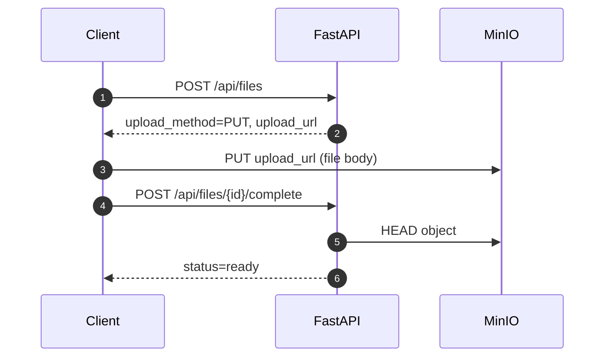
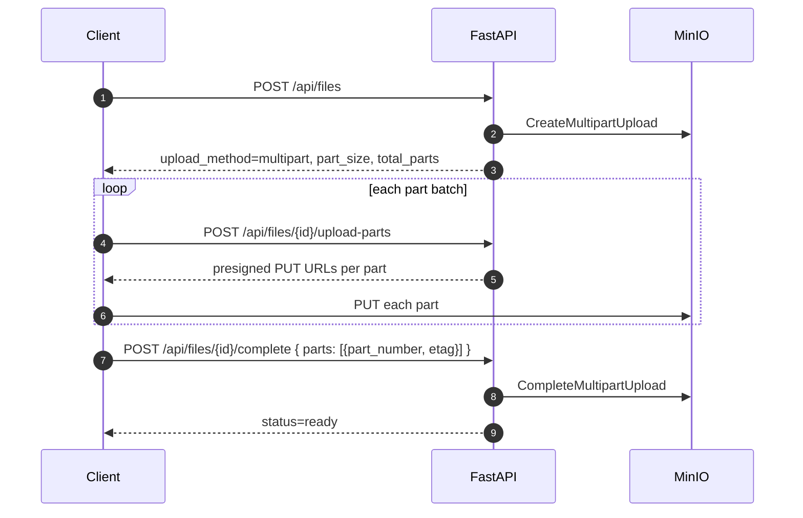
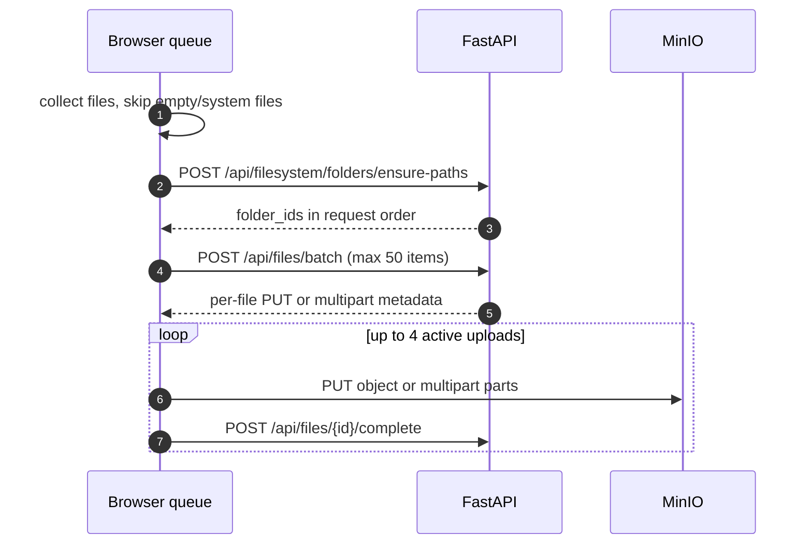

# File Share Service

A self-hosted file sharing & storage service. Backend in **FastAPI** with S3-compatible storage (**MinIO** locally), frontend in **React + Vite + TypeScript**, packaged as **Docker Compose**. Authentication uses **JWT**. Files live in a Drive-like folder tree in Postgres; bytes upload through **presigned PUT URLs** (the API signs and finalizes uploads, but never proxies file bytes). Shareable links support optional password protection and expiry.

## Stack

- **Frontend**: React 18 + Vite + TypeScript, Tailwind CSS + shadcn-style primitives (Radix), TanStack Query, Zustand, react-hook-form + zod, sonner toasts
- **API**: FastAPI + Pydantic v2
- **DB**: PostgreSQL 16 (async via SQLAlchemy 2 + asyncpg, migrations via Alembic)
- **Storage**: MinIO (S3 API, swappable for AWS S3 / Cloudflare R2)
- **Auth**: JWT (HS256) with Argon2 password hashing
- **Containers**: Docker Compose (`web`, `api`, `postgres`, `minio`, `minio-init`)

## Configuration (key env vars)

| Variable | Default | Notes |
|---|---|---|
| `JWT_SECRET` | `change-me-...` | **Set this** in production |
| `JWT_ACCESS_TTL_MINUTES` | `60` | Access token lifetime |
| `SINGLE_PUT_MAX_BYTES` | `5368709120` | **5 GB** — max size for a single presigned PUT |
| `MAX_FILE_BYTES` | `5497558138880` | **5 TiB** — max stored object (multipart above 5 GB) |
| `MULTIPART_PART_SIZE_BYTES` | `67108864` | **64 MiB** — size of each multipart part |
| `MULTIPART_PART_PRESIGN_BATCH` | `32` | Max multipart part numbers signed by the API per request |
| `S3_ENDPOINT_URL` | `http://minio:9000` | Used by API container internally |
| `S3_PUBLIC_ENDPOINT_URL` | `http://localhost:5173` | Fallback origin for presigned URLs; the API prefers the request `Origin` (then `Referer`) when present |
| `S3_BUCKET` | `files` | Bucket auto-created on startup |
| `PRESIGN_PUT_TTL_SECONDS` | `3600` | Upload URL lifetime |
| `PRESIGN_GET_TTL_SECONDS` | `900` | Download URL lifetime |

Copy `.env.example` to `.env` and override.

Presigned SigV4 URLs must use the **same host the browser will PUT/GET**. Point `S3_PUBLIC_ENDPOINT_URL` at the SPA origin (`:5173`), not the raw MinIO port. nginx (Docker) and Vite (local `npm run dev`) both reverse-proxy `/files/` so the signed path stays same-origin.

## Quick start

```bash
cp .env.example .env
docker compose up --build
```

Services:
- Web UI: <http://localhost:5173>
- API: <http://localhost:8000> (docs at `/docs`)
- MinIO S3 API (host): <http://localhost:19000> (container port `9000`; mapped to `19000` to avoid Windows reserved ranges)
- MinIO console: <http://localhost:19001> (default `minioadmin` / `minioadmin`)
- Postgres: `localhost:5432`

Database migrations run automatically on API start (see `scripts/entrypoint.sh`).

## Filesystem model

Each user has one root folder named **My files**, created at registration. Files store a `parent_folder_id`; folder placement is tracked in Postgres while object bytes remain in S3 under opaque keys like `users/{user_id}/{file_id}/{filename}`.

The dashboard lists **one folder at a time** via `GET /api/filesystem`. `GET /api/files` is still a flat list of the current user's files (newest first) and is not folder-scoped.

Folder rules:
- Names are trimmed. They cannot be `.` or `..`, and cannot contain `/` or `\`.
- Sibling names are unique **case-insensitively** per parent (`409` on collision).
- File create requests accept only a safe basename; path-like filenames are rejected. Folder uploads create folders first, then create each file in its target folder.
- The root folder cannot be renamed, moved, or deleted.
- A folder cannot be moved into itself or into one of its descendants.
- Deleting a folder deletes the subtree metadata and best-effort deletes or aborts child objects/uploads in storage.
- Migration `0003_folders.py` backfills existing users and converts stored path-like filenames into folder rows plus file basenames.

The UI (`FileBrowser`) can create, rename, and delete folders. The API `PATCH /api/filesystem/folders/{id}` can also **move** a folder by setting `parent_folder_id`; the current UI does not expose move.

## Upload flow

Files **≤ 5 GB** use a single presigned PUT. Files **> 5 GB** use S3 multipart upload (parts uploaded directly to storage; the API only signs URLs and finalizes). The `Content-Type` header is part of the PUT signature — the client must send the same type it registered.

### Single PUT (≤ 5 GB)


```mermaid
sequenceDiagram
  autonumber
  participant C as Client
  participant A as FastAPI
  participant S as MinIO
  C->>A: POST /api/files
  A-->>C: upload_method=PUT, upload_url
  C->>S: PUT upload_url (file body)
  C->>A: POST /api/files/{id}/complete
  A->>S: HEAD object
  A-->>C: status=ready
```

### Multipart (> 5 GB)


```mermaid
sequenceDiagram
  autonumber
  participant C as Client
  participant A as FastAPI
  participant S as MinIO
  C->>A: POST /api/files
  A->>S: CreateMultipartUpload
  A-->>C: upload_method=multipart, part_size, total_parts
  loop each part batch
    C->>A: POST /api/files/{id}/upload-parts
    A-->>C: presigned PUT URLs per part
    C->>S: PUT each part
  end
  C->>A: POST /api/files/{id}/complete { parts: [{part_number, etag}] }
  A->>S: CompleteMultipartUpload
  A-->>C: status=ready
```

Why presigned: file bytes never go through the API process; the FastAPI container only handles small JSON requests. In Docker, nginx serves the SPA and reverse-proxies both `/api/` and `/files/`. Local Vite does the same (`/files` → host MinIO on port `19000`), so browser PUT/GET can stay on the SPA origin while still reaching MinIO.

### Batch and folder uploads

The in-tab upload queue preserves directory drops and `<input webkitdirectory>` selections. Uploads land in the folder currently open on the dashboard (`?folder=`).


```mermaid
sequenceDiagram
  autonumber
  participant C as Browser queue
  participant A as FastAPI
  participant S as MinIO
  C->>C: collect files, skip empty/system files
  C->>A: POST /api/filesystem/folders/ensure-paths
  A-->>C: folder_ids in request order
  C->>A: POST /api/files/batch (max 50 items)
  A-->>C: per-file PUT or multipart metadata
  loop up to 4 active uploads
    C->>S: PUT object or multipart parts
    C->>A: POST /api/files/{id}/complete
  end
```

Queue constraints:
- `POST /api/files/batch` creates at most 50 file records per call.
- The queue runs up to 4 active file uploads in the tab.
- Multipart clients request part URLs in frontend batches of 16; the API accepts up to `MULTIPART_PART_PRESIGN_BATCH` (default 32) part numbers per call.
- `ensure-paths` takes up to 200 path lists. An empty path (`[]`) means “use the parent folder as-is”.
- The tab must stay open until queued uploads complete. The queue is not persisted across reloads. Failed uploads best-effort `DELETE` the pending file record; users can retry failed queue items.
- Empty files and common system files (`.DS_Store`, `Thumbs.db`, `desktop.ini`) are skipped by the frontend collector.

## Endpoints

Auth (public):
- `POST /api/auth/register` — `{ "email", "password" }` (also creates the user's root folder)
- `POST /api/auth/login` — form fields `username` (= email) + `password`, returns JWT
- `GET /api/auth/me` — current user (requires `Authorization: Bearer ...`)

Files (JWT required):
- `POST /api/files` — start one upload in `parent_folder_id` (omit/`null` = root; single PUT or multipart, based on size)
- `POST /api/files/batch` — start up to 50 uploads and return per-file upload instructions
- `POST /api/files/{file_id}/upload-parts` — presigned URLs for multipart part numbers
- `POST /api/files/{file_id}/complete` — finalize upload (`parts` required for multipart)
- `GET /api/files` — flat list of the current user's files (`limit` default 50, max 200)
- `GET /api/files/{file_id}` — metadata
- `GET /api/files/{file_id}/download` — presigned GET URL
- `DELETE /api/files/{file_id}` — delete metadata + object (or abort in-flight multipart)

Filesystem (JWT required):
- `GET /api/filesystem?folder_id={id}` — list one folder's breadcrumbs, child folders, and child files; omit `folder_id` for root (`limit` default 100, max 200)
- `GET /api/filesystem/root` — current user's root folder
- `POST /api/filesystem/folders` — create child folder `{ "parent_folder_id", "name" }`
- `PATCH /api/filesystem/folders/{folder_id}` — rename and/or move a non-root folder
- `DELETE /api/filesystem/folders/{folder_id}` — delete a non-root folder subtree
- `POST /api/filesystem/folders/ensure-paths` — create/reuse nested folder paths for folder uploads (`{ "parent_folder_id", "paths": [["docs","img"], []] }`)

Shares (JWT required):
- `POST /api/files/{file_id}/shares` — create share link with optional `expires_in_seconds` and `password` (file must be `ready`)
- `GET /api/files/{file_id}/shares` — list shares for a file
- `DELETE /api/files/{file_id}/shares/{token}` — revoke

Public (no auth):
- `GET /api/public/{token}` — share metadata (filename, size, password_protected, expires_at)
- `POST /api/public/{token}/download` — body `{ "password": "..." }` if protected; returns presigned URL

Health:
- `GET /health`

## Example

```bash
# 1. register & login
curl -s -X POST http://localhost:8000/api/auth/register \
  -H 'Content-Type: application/json' \
  -d '{"email":"me@example.com","password":"supersecret1"}'

TOKEN=$(curl -s -X POST http://localhost:8000/api/auth/login \
  -d 'username=me@example.com&password=supersecret1' | jq -r .access_token)

# 2. create a folder and request an upload URL in it
#    Origin tells the API which host to sign (SPA proxy). Omit it only if
#    S3_PUBLIC_ENDPOINT_URL already matches a reachable /files/ proxy.
ROOT_ID=$(curl -s http://localhost:8000/api/filesystem/root \
  -H "Authorization: Bearer $TOKEN" | jq -r .id)

FOLDER_ID=$(curl -s -X POST http://localhost:8000/api/filesystem/folders \
  -H "Authorization: Bearer $TOKEN" \
  -H 'Content-Type: application/json' \
  -d "{\"parent_folder_id\":\"$ROOT_ID\",\"name\":\"docs\"}" | jq -r .id)

RESP=$(curl -s -X POST http://localhost:8000/api/files \
  -H "Authorization: Bearer $TOKEN" \
  -H 'Origin: http://localhost:5173' \
  -H 'Content-Type: application/json' \
  -d "{\"parent_folder_id\":\"$FOLDER_ID\",\"filename\":\"hello.txt\",\"content_type\":\"text/plain\",\"size_bytes\":12}")

FID=$(echo $RESP | jq -r .file_id)
URL=$(echo $RESP | jq -r .upload_url)

# 3. upload through the SPA /files/ proxy (web or Vite must be running)
echo -n 'hello world!' | curl -X PUT "$URL" -H 'Content-Type: text/plain' --data-binary @-

# 4. mark as ready
curl -s -X POST "http://localhost:8000/api/files/$FID/complete" \
  -H "Authorization: Bearer $TOKEN"

# 5. share + download as guest
SHARE=$(curl -s -X POST "http://localhost:8000/api/files/$FID/shares" \
  -H "Authorization: Bearer $TOKEN" \
  -H 'Content-Type: application/json' \
  -d '{"expires_in_seconds":3600}')

TOK=$(echo $SHARE | jq -r .token)
DL=$(curl -s -X POST "http://localhost:8000/api/public/$TOK/download" \
  -H 'Origin: http://localhost:5173' \
  -H 'Content-Type: application/json' -d '{}' | jq -r .download_url)

curl -L "$DL"
```

API-only (no web/Vite): send `Origin: http://localhost:19000` so presigned URLs hit the host-mapped MinIO port directly.

## Tests

Tests run as integration tests against the live stack:

```bash
docker compose up -d
docker compose exec api pip install pytest pytest-asyncio
docker compose exec api pytest -q
```

Frontend type-check/build:

```bash
cd web
npm install
npm run build
```

Smoke test from inside the API container: `docker compose exec api python scripts/smoke_test.py`.

## Troubleshooting

- **`SignatureDoesNotMatch` on upload/download.** The signed host (including port) must match what the browser calls. Use the SPA origin (`http://localhost:5173` or `http://<lan-ip>:5173`). nginx forwards `Host` as `$http_host` (port included); `$host` strips the port and breaks SigV4 on `:5173`.
- **PUT URL points at MinIO `:9000` / `:19000` from a phone.** iOS browsers often rewrite cross-origin downloads back to the SPA origin. Keep presigned URLs on `:5173` and let nginx/Vite proxy `/files/`.
- **Folder uploads flatten to the current directory.** The API rejects `/` in `filename`. The browser must supply relative paths (`webkitRelativePath` or drag-and-drop directory entries). Confirm `POST /api/filesystem/folders/ensure-paths` ran before `POST /api/files/batch`.
- **Uploads fail after `npm run dev` without Docker web.** Vite proxies `/files` to `http://localhost:19000`. MinIO must be mapped on that host port (`docker compose` does this).
- **Schema / folder tests fail on an already-running API.** Alembic runs on container start (`scripts/entrypoint.sh`). Recreate the API container after migration changes: `docker compose up -d --force-recreate api`.
- **Cannot delete/rename “My files”.** That is the per-user root (`is_root=true`). Create children under it instead.

## Security notes (MVP scope)

- All file types are accepted by design. The service does **not** scan for malware/executables — treat uploads as untrusted; for production add ClamAV or similar.
- JWT secret must be rotated for production; access tokens are short-lived (60 min default).
- Presigned URLs are time-limited; revoke shares via DELETE.
- Postgres and MinIO ports are exposed in compose for local development; restrict in production.

## Project layout

```
app/                 # FastAPI backend
  main.py            # FastAPI factory + lifespan
  config.py          # Settings (pydantic-settings)
  db.py              # async SQLAlchemy engine/session
  models.py          # User, Folder, StoredFile, ShareLink
  schemas.py         # Pydantic schemas
  security.py        # Argon2 + JWT
  deps.py            # get_current_user, get_owned_file
  filesystem.py      # folder helpers, CTE breadcrumbs/subtree, deletion
  storage.py         # S3/MinIO client + Origin-aware presigned URLs
  routers/           # auth, filesystem, files, shares, public
alembic/             # migrations (0003_folders.py adds the tree)
scripts/entrypoint.sh
web/                 # React + Vite frontend
  src/
    main.tsx, App.tsx
    lib/             # axios, auth-store, api/* clients, upload queue, collectFiles
    components/      # ui/, layout/, files/ (FileBrowser, FolderNameDialog)
    pages/           # Login, Register, Dashboard, FileDetail, PublicShare
    hooks/           # useFilesystem, useFiles, useUpload, useTheme
  Dockerfile         # multi-stage build -> nginx:alpine
  nginx.conf         # SPA fallback, /api proxy, /files MinIO proxy, asset caching
docker-compose.yml
Dockerfile
```

## Frontend

The UI is a single-page React app served by **nginx** in production builds. It uses JWT (stored in `localStorage`) to talk to the API, browses Drive-like folders, uploads through a persistent **in-tab** queue, and renders a Linear/Notion-inspired layout with dark mode.

### Dev workflow

```bash
cd web
cp .env.example .env       # VITE_API_URL=http://localhost:8000
npm install
npm run dev                # http://localhost:5173 with HMR
```

The dev server proxies `/api` → `localhost:8000` and `/files` → `localhost:19000`. The simplest setup: `docker compose up -d api postgres minio`, then `npm run dev` on the host. If `VITE_API_URL` is unset, the bundle uses `window.location.origin` (same as the Docker nginx build).

### Build & serve (Docker)

```bash
docker compose up -d --build web
# http://localhost:5173  (nginx serving the built SPA)
```

nginx proxies `/api/` to the `api` container and `/files/` to MinIO, so the bundle uses **relative URLs** by default — the frontend automatically targets whatever host the SPA was served from (localhost, LAN IP, custom domain) without rebuilding.

If you want the SPA to talk to an API on a different origin, bake the absolute URL in:

```bash
VITE_API_URL=https://api.example.com docker compose build web
```

### Accessing from another device on the LAN (e.g. your phone)

The frontend works on any reachable host. Presigned URLs must use the same origin the browser will call. The API prefers the request `Origin` header automatically; keep `S3_PUBLIC_ENDPOINT_URL` as a fallback that points at the SPA/nginx origin, **not** the raw MinIO host:

```env
# .env
S3_PUBLIC_ENDPOINT_URL=http://192.168.x.x:5173   # your host's LAN IP and web port
```

Then restart the API container (`docker compose up -d --force-recreate api`). Browsers on the same network can now open `http://192.168.x.x:5173/...` and uploads/downloads will work.

### Routes

- `/login`, `/register` — auth (public)
- `/` — dashboard with folder browser and drag-drop upload tray (JWT required). Current folder is `?folder=<id>`.
- `/file/:id` — metadata + share-link management (`/files/*` is reserved for the MinIO path-style proxy)
- `/s/:token` — public share page (no auth; password gate if needed)

For production, lock the API's CORS origins to your real domain (see `app/main.py`). Presigned URLs come from the API; in Docker they route through nginx's `/files/` proxy so mobile and LAN clients avoid cross-origin MinIO downloads.

## Roadmap (out of MVP)

- Refresh tokens / token rotation
- Antivirus / content scanning
- Per-user quotas + usage analytics
- Background cleanup of expired files & shares
