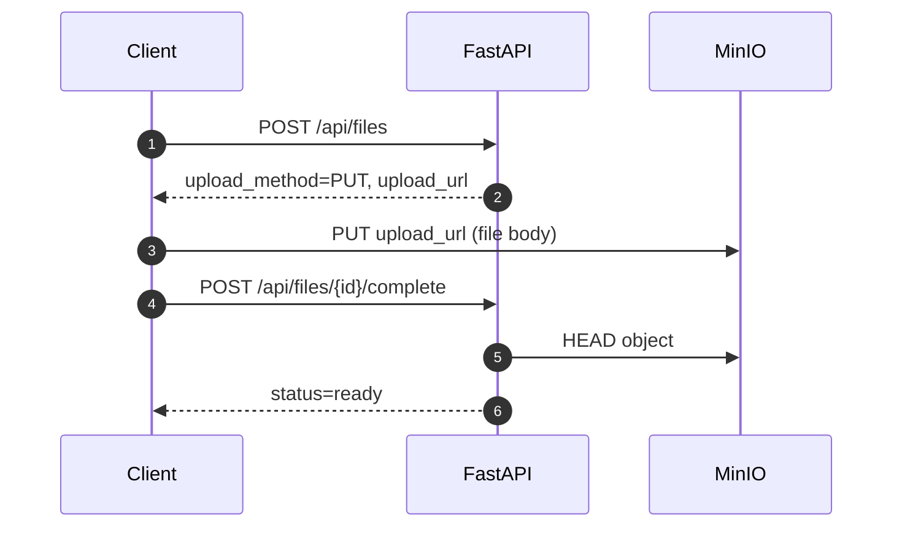
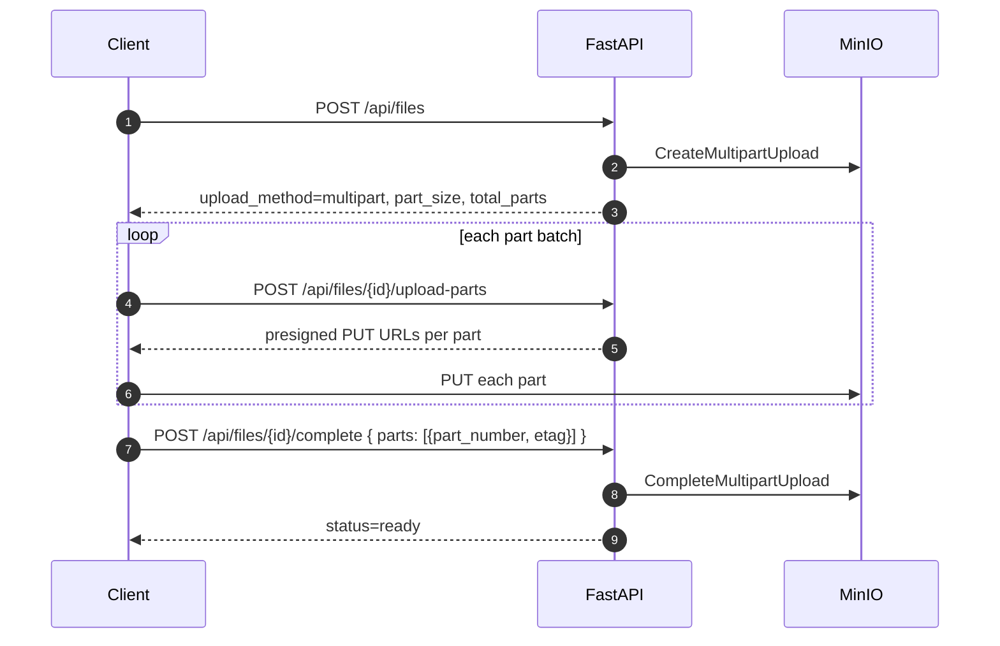
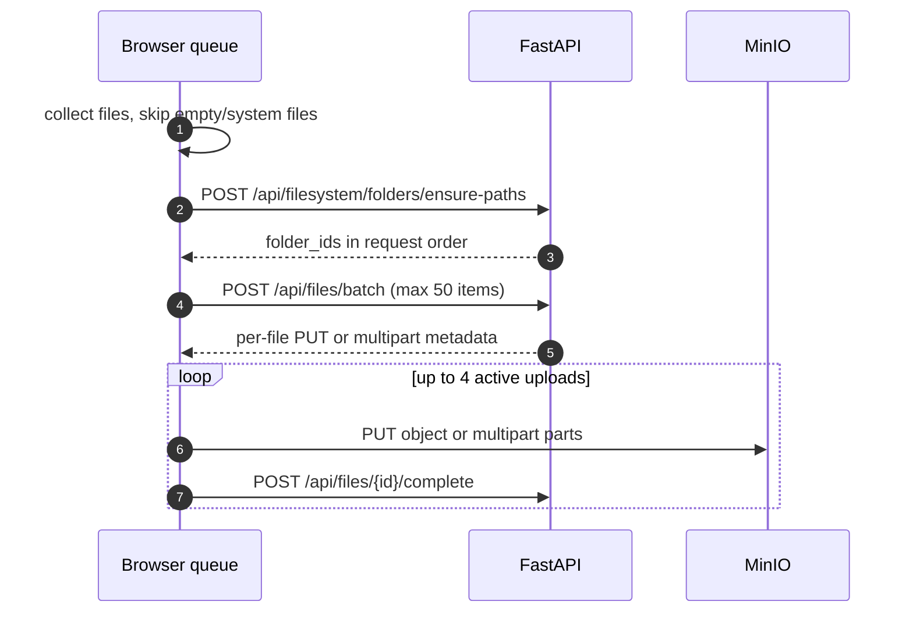

# File Share Service

A self-hosted file sharing & storage service. Backend in **FastAPI** with S3-compatible storage (**MinIO** locally), frontend in **React + Vite + TypeScript**, packaged as **Docker Compose**. Authentication uses **JWT**, files upload through presigned object-storage URLs (the API signs and finalizes uploads, but does not handle file bytes), and shareable links support optional password protection and expiry.

## Stack

- **Frontend**: React 18 + Vite + TypeScript, Tailwind CSS + shadcn-style primitives (Radix), TanStack Query, Zustand, react-hook-form + zod, sonner toasts
- **API**: FastAPI + Pydantic v2
- **DB**: PostgreSQL 16 (async via SQLAlchemy 2 + asyncpg, migrations via Alembic)
- **Storage**: MinIO (S3 API, swappable for AWS S3 / Cloudflare R2)
- **Auth**: JWT (HS256) with Argon2 password hashing
- **Containers**: Docker Compose (`web`, `api`, `postgres`, `minio`, `minio-init`)

## Configuration (key env vars)

| Variable | Default | Notes |
|---|---|---|
| `JWT_SECRET` | `change-me-...` | **Set this** in production |
| `JWT_ACCESS_TTL_MINUTES` | `60` | Access token lifetime |
| `SINGLE_PUT_MAX_BYTES` | `5368709120` | **5 GB** — max size for a single presigned PUT |
| `MAX_FILE_BYTES` | `5497558138880` | **5 TiB** — max stored object (multipart above 5 GB) |
| `MULTIPART_PART_SIZE_BYTES` | `67108864` | **64 MiB** — size of each multipart part |
| `S3_ENDPOINT_URL` | `http://minio:9000` | Used by API container internally |
| `S3_PUBLIC_ENDPOINT_URL` | `http://localhost:5173` | Fallback origin for presigned URLs; the API prefers the request `Origin` when present |
| `S3_BUCKET` | `files` | Bucket auto-created on startup |
| `MULTIPART_PART_PRESIGN_BATCH` | `32` | Max multipart part numbers signed by the API per request |
| `PRESIGN_PUT_TTL_SECONDS` | `3600` | Upload URL lifetime |
| `PRESIGN_GET_TTL_SECONDS` | `900` | Download URL lifetime |

Copy `.env.example` to `.env` and override.

## Quick start

```bash
cp .env.example .env
docker compose up --build
```

Services:
- Web UI: <http://localhost:5173>
- API: <http://localhost:8000> (docs at `/docs`)
- MinIO console: <http://localhost:19001> (default `minioadmin` / `minioadmin`; host port `19001` avoids Windows reserved ranges around 9000–9001)
- Postgres: `localhost:5432`

Database migrations run automatically on API start (see `scripts/entrypoint.sh`).

## Filesystem model

Each user has one root folder named `My files`. Files store a `parent_folder_id`, so folder placement is tracked in Postgres while object bytes remain in S3 under opaque keys like `users/{user_id}/{file_id}/{filename}`.

Folder rules:
- Folder names are trimmed, case-insensitive per parent (`name_lower`), and cannot be `.`, `..`, or contain `/` or `\`.
- File create requests accept only a safe basename; path-like filenames are rejected. Folder uploads create folders first (`ensure-paths`), then create each file under its resolved `parent_folder_id`.
- Moving a folder rejects self-parenting and cycles (cannot move into a descendant). The root folder cannot be renamed, moved, or deleted.
- Deleting a non-root folder collects the subtree with a recursive CTE, removes child file rows, best-effort aborts multipart uploads / deletes S3 objects, then deletes folder rows.
- Tree walks (breadcrumbs, descendant checks, subtree collection) use recursive SQL CTEs rather than N+1 ORM walks (`app/filesystem.py`).
- The root folder is created at registration (`create_user_root`). Migration `0003_folders.py` backfills existing users and converts stored path-like filenames into folder rows plus file basenames.

## Upload flow

Files **≤ 5 GB** use a single presigned PUT. Files **> 5 GB** use S3 multipart upload (parts uploaded directly to storage; the API only signs URLs and finalizes).

### Single PUT (≤ 5 GB)


```mermaid
sequenceDiagram
  autonumber
  participant C as Client
  participant A as FastAPI
  participant S as MinIO
  C->>A: POST /api/files
  A-->>C: upload_method=PUT, upload_url
  C->>S: PUT upload_url (file body)
  C->>A: POST /api/files/{id}/complete
  A->>S: HEAD object
  A-->>C: status=ready
```

### Multipart (> 5 GB)


```mermaid
sequenceDiagram
  autonumber
  participant C as Client
  participant A as FastAPI
  participant S as MinIO
  C->>A: POST /api/files
  A->>S: CreateMultipartUpload
  A-->>C: upload_method=multipart, part_size, total_parts
  loop each part batch
    C->>A: POST /api/files/{id}/upload-parts
    A-->>C: presigned PUT URLs per part
    C->>S: PUT each part
  end
  C->>A: POST /api/files/{id}/complete { parts: [{part_number, etag}] }
  A->>S: CompleteMultipartUpload
  A-->>C: status=ready
```

Why presigned: file bytes never go through the API process; the FastAPI container only handles small JSON requests. In the Docker build, nginx serves the SPA and reverse-proxies both `/api/` and `/files/`, so browser PUT/GET requests can use the same origin as the web app while still reaching MinIO directly behind nginx.

### Batch and folder uploads

The browser upload queue preserves directory drops and `<input webkitdirectory>` selections:


```mermaid
sequenceDiagram
  autonumber
  participant C as Browser queue
  participant A as FastAPI
  participant S as MinIO
  C->>C: collect files, skip empty/system files
  C->>A: POST /api/filesystem/folders/ensure-paths
  A-->>C: folder_ids in request order
  C->>A: POST /api/files/batch (max 50 items)
  A-->>C: per-file PUT or multipart metadata
  loop up to 4 active uploads
    C->>S: PUT object or multipart parts
    C->>A: POST /api/files/{id}/complete
  end
```

Queue constraints (`web/src/lib/uploadQueue.ts`, `collectFiles.ts`):
- Batches create up to 50 file records at a time (`FileBatchCreateIn` / `BATCH_CREATE_SIZE`).
- The queue runs up to 4 active file uploads in the tab (`MAX_PARALLEL_UPLOADS`).
- Multipart clients request upload-part URLs in frontend batches of 16 (`PRESIGN_BATCH`), while the API accepts up to `MULTIPART_PART_PRESIGN_BATCH` (default 32) part numbers per call.
- Each enqueue captures the current dashboard folder as `targetParentFolderId`. Relative path segments from the drop/picker are then ensured under that base.
- The queue is a module singleton for the tab lifetime — keep the tab open until uploads finish. Failed uploads best-effort `DELETE` the pending file record; users can retry failed items.
- Cancel marks an item cancelled; if cancel races a in-flight batch create, the create response may re-queue the item. Prefer removing finished/cancelled items from the UI list after uploads settle.
- Empty files and common system files (`.DS_Store`, `Thumbs.db`, `desktop.ini`) are skipped by the frontend collector.

Client constraints for `/complete`:
- Call `/complete` once after a successful object/parts upload. For multipart files that are already `ready`, a second `/complete` currently follows the single-PUT verification path and can delete the object if size exceeds `SINGLE_PUT_MAX_BYTES`.

## Endpoints

Auth (public):
- `POST /api/auth/register` — `{ "email", "password" }`
- `POST /api/auth/login` — form fields `username` (= email) + `password`, returns JWT
- `GET /api/auth/me` — current user (requires `Authorization: Bearer ...`)

Files (JWT required):
- `POST /api/files` — start one upload in `parent_folder_id` (single PUT or multipart, based on size)
- `POST /api/files/batch` — start up to 50 uploads and return per-file upload instructions
- `POST /api/files/{file_id}/upload-parts` — presigned URLs for multipart part numbers
- `POST /api/files/{file_id}/complete` — finalize upload (`parts` required for multipart)
- `GET /api/files` — list current user's files
- `GET /api/files/{file_id}` — metadata
- `GET /api/files/{file_id}/download` — presigned GET URL
- `DELETE /api/files/{file_id}` — delete metadata + object

Filesystem (JWT required):
- `GET /api/filesystem?folder_id={id}` — list one folder's breadcrumbs, child folders, and child files (each list capped, default 100 / max 200); omit `folder_id` for root
- `GET /api/filesystem/root` — current user's root folder (`name` always displayed as `My files`)
- `POST /api/filesystem/folders` — create child folder `{ "parent_folder_id", "name" }` (409 on duplicate name under the same parent)
- `PATCH /api/filesystem/folders/{folder_id}` — rename and/or move a non-root folder
- `DELETE /api/filesystem/folders/{folder_id}` — delete a non-root folder subtree (204)
- `POST /api/filesystem/folders/ensure-paths` — `{ "parent_folder_id", "paths": [["a","b"], ...] }` create/reuse nested paths; returns `folder_ids` in request order (max 200 paths)

Shares (JWT required):
- `POST /api/files/{file_id}/shares` — create share link with optional `expires_in_seconds` and `password`
- `GET /api/files/{file_id}/shares` — list shares for a file
- `DELETE /api/files/{file_id}/shares/{token}` — revoke

Public (no auth):
- `GET /api/public/{token}` — share metadata (filename, size, password_protected, expires_at)
- `POST /api/public/{token}/download` — body `{ "password": "..." }` if protected; returns presigned URL

Health:
- `GET /health`

## Example

```bash
# 1. register & login
curl -s -X POST http://localhost:8000/api/auth/register \
  -H 'Content-Type: application/json' \
  -d '{"email":"me@example.com","password":"supersecret1"}'

TOKEN=$(curl -s -X POST http://localhost:8000/api/auth/login \
  -d 'username=me@example.com&password=supersecret1' | jq -r .access_token)

# 2. create a folder and request an upload URL in it
ROOT_ID=$(curl -s http://localhost:8000/api/filesystem/root \
  -H "Authorization: Bearer $TOKEN" | jq -r .id)

FOLDER_ID=$(curl -s -X POST http://localhost:8000/api/filesystem/folders \
  -H "Authorization: Bearer $TOKEN" \
  -H 'Content-Type: application/json' \
  -d "{\"parent_folder_id\":\"$ROOT_ID\",\"name\":\"docs\"}" | jq -r .id)

RESP=$(curl -s -X POST http://localhost:8000/api/files \
  -H "Authorization: Bearer $TOKEN" \
  -H 'Content-Type: application/json' \
  -d "{\"parent_folder_id\":\"$FOLDER_ID\",\"filename\":\"hello.txt\",\"content_type\":\"text/plain\",\"size_bytes\":12}")

FID=$(echo $RESP | jq -r .file_id)
URL=$(echo $RESP | jq -r .upload_url)

# 3. upload directly to MinIO
echo -n 'hello world!' | curl -X PUT "$URL" -H 'Content-Type: text/plain' --data-binary @-

# 4. mark as ready
curl -s -X POST "http://localhost:8000/api/files/$FID/complete" \
  -H "Authorization: Bearer $TOKEN"

# 5. share + download as guest
SHARE=$(curl -s -X POST "http://localhost:8000/api/files/$FID/shares" \
  -H "Authorization: Bearer $TOKEN" \
  -H 'Content-Type: application/json' \
  -d '{"expires_in_seconds":3600}')

TOK=$(echo $SHARE | jq -r .token)
DL=$(curl -s -X POST "http://localhost:8000/api/public/$TOK/download" \
  -H 'Content-Type: application/json' -d '{}' | jq -r .download_url)

curl -L "$DL"
```

## Tests

Tests run as integration tests against the live stack (`tests/test_auth.py`, `tests/test_files.py`, `tests/test_folders.py`):

```bash
docker compose up -d
docker compose exec api pip install pytest pytest-asyncio
docker compose exec api pytest -q
```

Folder coverage includes root creation, ensure-paths, rename/move cycle rejection, and subtree delete behavior.
Frontend type-check/build:

```bash
cd web
npm install
npm run build
```

Operational checks:
- If uploads fail with `SignatureDoesNotMatch`, confirm the presigned URL host and port match the browser origin. In Docker, use the SPA origin (`http://localhost:5173` or a LAN host on port `5173`) so nginx can preserve the signed `/files/...` path and forward `$http_host` (including port) to MinIO.
- Vite HMR (`npm run dev`) proxies `/api` → `localhost:8000` and `/files` → `localhost:19000` (compose maps MinIO `9000` → host `19000`). Presigned URLs still need the SPA origin (`:5173`) so the Vite proxy sees `/files/...`.
- If folder uploads flatten unexpectedly, verify the browser provided relative paths (`webkitRelativePath` or drag-and-drop directory entries). The API intentionally rejects path separators in `filename`.
- Deep-linking into a folder uses `/?folder=<uuid>`. Upload destination comes from the listing's resolved `folder_id` once loaded; wait for the listing before dropping files into a deep-linked subfolder.
- If API tests fail after schema changes, check Alembic migrations first; the API entrypoint runs migrations on container start, but already-running containers need a recreate (`docker compose up -d --force-recreate api`).
- MinIO console is on host port `19001` (not `9001`) to avoid Windows reserved ranges around 9000–9001.

## Security notes (MVP scope)

- All file types are accepted by design. The service does **not** scan for malware/executables — treat uploads as untrusted; for production add ClamAV or similar.
- JWT secret must be rotated for production; access tokens are short-lived (60 min default).
- Presigned URLs are time-limited; revoke shares via DELETE.
- Postgres and MinIO ports are exposed in compose for local development; restrict in production.

## Project layout

```
app/                 # FastAPI backend
  main.py            # FastAPI factory + lifespan
  config.py          # Settings (pydantic-settings)
  db.py              # async SQLAlchemy engine/session
  models.py          # User, Folder, StoredFile, ShareLink
  schemas.py         # Pydantic schemas
  security.py        # Argon2 + JWT
  deps.py            # get_current_user
  filesystem.py      # folder hierarchy helpers + subtree deletion
  storage.py         # S3/MinIO client + presigned URLs
  routers/           # auth, filesystem, files, shares, public
alembic/             # migrations
scripts/entrypoint.sh
web/                 # React + Vite frontend
  src/
    main.tsx, App.tsx
    lib/             # axios, auth-store, api/* clients, upload queue
    components/      # ui/, layout/, files/
    pages/           # Login, Register, Dashboard, FileDetail, PublicShare
    hooks/           # useFilesystem, useFiles, useUpload, useTheme
  Dockerfile         # multi-stage build -> nginx:alpine
  nginx.conf         # SPA fallback, /api proxy, /files MinIO proxy, asset caching
docker-compose.yml
Dockerfile
```

## Frontend

The UI is a single-page React app served by **nginx** in production builds. It uses JWT (stored in `localStorage`) to talk to the API, manages Drive-like folders via `FileBrowser` + `useFilesystem`, uploads through an in-tab `UploadQueue`, and renders a Linear/Notion-inspired layout with dark mode.

### Dev workflow

```bash
cd web
cp .env.example .env       # VITE_API_URL=http://localhost:8000
npm install
npm run dev                # http://localhost:5173 with HMR
```

The simplest setup: keep storage/API running via `docker compose up -d api postgres minio minio-init`, and run `npm run dev` on the host. Relative `/api` and `/files` requests are proxied by Vite (see `web/vite.config.ts`).

### Build & serve (Docker)

```bash
docker compose up -d --build web
# http://localhost:5173  (nginx serving the built SPA)
```

nginx proxies `/api/` to the `api` container and `/files/` to MinIO, so the bundle uses **relative URLs** by default - the frontend automatically targets whatever host the SPA was served from (localhost, LAN IP, custom domain) without rebuilding.

If you want the SPA to talk to an API on a different origin, bake the absolute URL in:

```bash
VITE_API_URL=https://api.example.com docker compose build web
```

### Accessing from another device on the LAN (e.g. your phone)

The frontend works on any reachable host. Presigned URLs must use the same origin the browser will call. The API prefers the request `Origin` header automatically; keep `S3_PUBLIC_ENDPOINT_URL` as a fallback that points at the SPA/nginx origin, not the raw MinIO host:

```env
# .env
S3_PUBLIC_ENDPOINT_URL=http://192.168.x.x:5173   # your host's LAN IP and web port
```

Then restart the API container (`docker compose up -d --force-recreate api`). Browsers on the same network can now open `http://192.168.x.x:5173/...` and uploads/downloads will work.

### Routes

- `/login`, `/register` — auth (public)
- `/?folder=<uuid>` — dashboard folder browser + drag-drop upload tray (JWT required; omit `folder` for root)
- `/file/:id` — metadata + share-link management (`/files/*` is reserved for the MinIO path-style bucket proxy)
- `/s/:token` — public share page (no auth; password gate if needed; session hydrate is skipped on this path)

For production, lock the API's CORS origins to your real domain (see `app/main.py`). Presigned URLs come from the API; in Docker they route through nginx's `/files/` proxy so mobile and LAN clients avoid cross-origin MinIO downloads.

## Roadmap (out of MVP)

- Refresh tokens / token rotation
- Antivirus / content scanning
- Per-user quotas + usage analytics
- Background cleanup of expired files & shares
